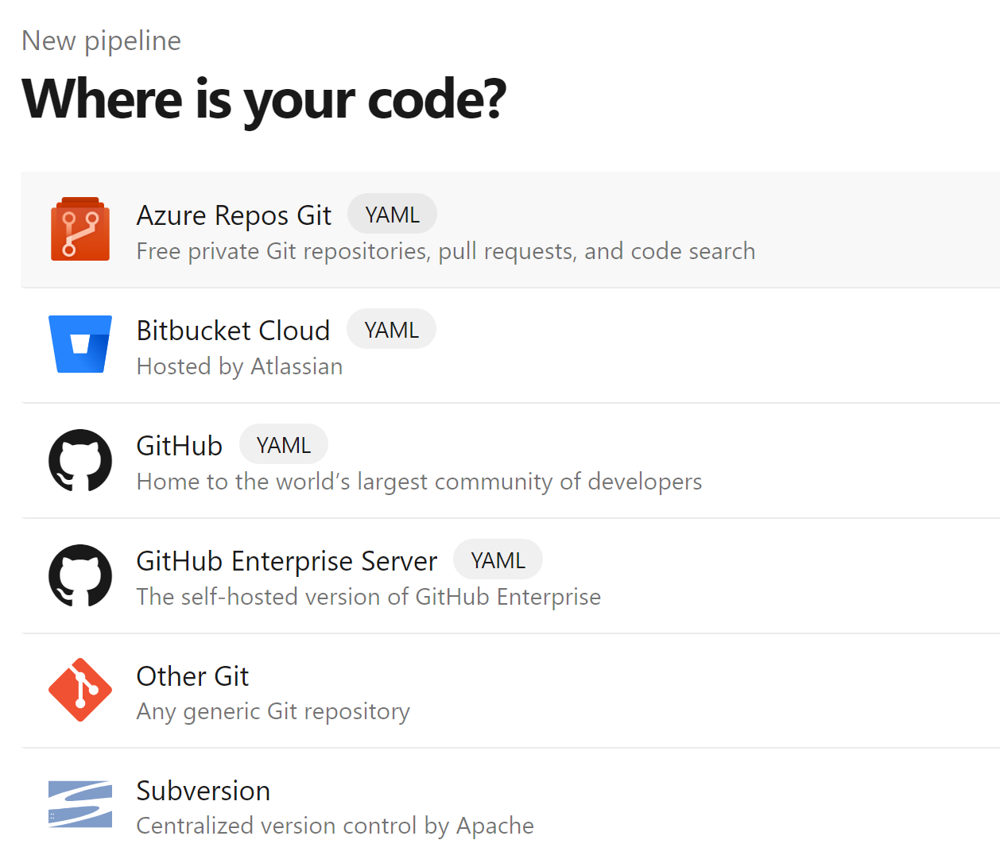
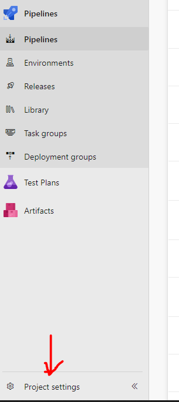
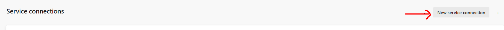

# Pipelines

So far, we've built a basic app in Go, with our tests, built an image, pushed it to our container registry, and deployed it to our container app.

However, this does mean we have to manually build, push, and deploy our image each time.

It's time to build our own *pipeline* to automate this process for us.


## Stages
Stages are the big-picture phases of our pipeline. Think of them as the major milestones or environments our code goes through. Each stage can represent different environments like Dev, Test, QA, and Production. We can use stages to orchestrate complex workflows and ensure our code goes through a rigorous process before hitting production.

**How we use stages**
- Define distinct environments or phases.
- Control the flow of our pipeline from one stage to the next.
- Set up approval gates and conditions to promote quality and compliance.

## Jobs
Jobs are the individual units of work within a stage. Each job runs on a specific agent (either on-premises or in the cloud) and can execute multiple steps. Jobs are great for organizing tasks that can run in parallel or need to be isolated.

**How we use jobs**
- Parallelize tasks to speed up the pipeline.
- Isolate environments or dependencies for different tasks.
- Manage resource allocation by specifying which agent to use.

## Steps
Steps are the smallest units of work within a job. These can be scripts, tasks, or any action that needs to be executed. Steps are where the actual commands and operations happen, like building code, running tests, or deploying artifacts.

**How we use steps**
- Execute specific commands or scripts.
- Use built-in tasks to perform common actions (e.g., copying files, installing dependencies).
- Define the sequence of operations within a job to ensure tasks are completed in order.

## Putting It All Together
1. **Stages** We outline the major environments or phases (Dev, Test, Prod).
2. **Jobs** Within each stage, we define jobs to run tasks either sequentially or in parallel.
3. **Steps** Within each job, we specify the steps to carry out the actual work.

## Example
Here's an example of what a pipeline looks like:

```yaml
stages:
- stage: Build
  jobs:
  - job: BuildJob
    steps:
    - script: echo Building the code...
    - task: UseDotNet@2
      inputs:
        command: 'restore'
    - script: dotnet build

- stage: Test
  dependsOn: Build
  jobs:
  - job: TestJob
    steps:
    - script: echo Running tests...
    - task: DotNetCoreCLI@2
      inputs:
        command: 'test'
        projects: '**/*Tests/*.csproj'

- stage: Deploy
  dependsOn: Test
  jobs:
  - deployment: DeployJob
    environment: 'Production'
    strategy:
      runOnce:
        deploy:
          steps:
          - script: echo Deploying to production...
          - task: AzureRmWebAppDeployment@4
            inputs:
              appType: 'webApp'
              azureSubscription: 'my-subscription'
              appName: 'my-app'
```

---

## What is YAML?
YAML stands for "Yet Another Markup Language" (or "YAML Ain't Markup Language"..opinions differ). It's a human-readable data serialization standard (like JSON) that is often used for configuration files and data exchange between languages with different data structures. 

YAML is designed to be easy to read and write, making it a popular choice for developers and system administrators who can't write actual code.

## Key Features
- **Language-Agnostic** YAML is not tied to any specific programming language, making it versatile for different applications.
- **Indentation-Based Structure** YAML uses indentation to represent the structure of the data, similar to how Python handles blocks of code. Which is another reason to dislike it, but I digress...

## Basic Syntax

### Scalars
Scalars are single values like strings, integers, and booleans.

```yaml
string: "Hello, World!"
integer: 42
float: 3.14
boolean: true
```

### Lists
Lists are sequences of items. In YAML, lists are represented with a dash (-) followed by a space.

```yaml
fruits:
  - Apple
  - Orange
  - Banana
```

### Dictionaries
Dictionaries (also known as mappings or hashes) are *key-value pairs*. Each key is followed by a colon (:) and a space, then the value.

```yaml
person:
  name: John Doe
  age: 30
  email: johndoe@example.com
```

### Nested Structures
YAML supports nested lists and dictionaries to represent complex data structures.

```yaml
company:
  name: Acme Corp
  employees:
    - name: Jane Smith
      position: Developer
    - name: John Doe
      position: Designer
  locations:
    headquarters: New York
    branches:
      - Los Angeles
      - Chicago
```

---

## Building Our Pipeline

> :exclamation: This guide assumes you have completed [Containerization](https://github.com/bjssacademy/go-containerization) to create your Dockerfile and ACR.

We're going to create our pipeline using three stages - Build, Test, and Deploy.

- Build creates our image and pushes it to ACR
- Tests runs our unit tests
- Deploy grabs the image from ACR and deploys it tour our container app

We do this - in Azure, other vary - by creating a file named `azure-pipeline.yml` in the root of our repository. 

### Create 

Whilst you *can* create you file manually in the root of your repository locally and push, we'll have a quick explore of using the UI.

Go to Azure DevOps (where your repository is, usually https://dev.azure.com), and go to your project (For those doing this as BJSS Academy it's `bjss-academy-students`).

You'll need to select the Pipelines option on the left-hand tab:


Next, create a new pipeline:


Now we get the option of *where* our code repository is. We're going to choose the Azure Repos Git:



Next, select your respository from the list:


Now we pick the starter template:


> We don't use the Go template as it is for older Go versions.

And here's our "starter" that Azure gives us:


- trigger: This specifies that the pipeline will automatically run whenever there are changes pushed to the master branch.
- pool: This defines the pool of agents that will run the pipeline. Here, it's using the latest Ubuntu image (ubuntu-latest) as the virtual machine (VM) for the build agent.
- steps: This is where the individual tasks or commands to be run are defined.
    - script: echo Hello, world!: This is a single-line script that prints "Hello, world!" to the console.
    - displayName: This provides a friendly name for the step, which is displayed in the pipeline's output log.
- script: This is a multi-line script that prints a couple of messages to the console.
    - The | character indicates that the script contains multiple lines.
    - displayName: This provides a friendly name for the step.

:exclamation: DELETE this starter template, we'll be creating ours from scratch.

### Trigger & Variables

Our file is going to look a *tiny* bit different.

We said there is a *trigger* that kicks off the build. We're going to use `main` which is the *branch* we will build from when it is updated (eg, you push changes to it). Put this at the top of your file:

```yaml
trigger:
- main  # Define the branch to trigger the pipeline

resources:
- repo: self
```

Now we're going to set up some variables - this just makes it easier to change our file by making one change rather than copy/pasting all over the file!

> In order to access the ACR Repo you will need to provide details of a Service Connection. This has been pre-configured as: `dockerRegistryServiceConnection: 'Docker ACR'

Add the following next in your file:

```yaml
variables:
  dockerRegistryServiceConnection: 'Docker ACR'
  imageRepository: 'your-image' #eg 'amiga/dan-webb-example-app'
  containerRegistry: 'your-registry' # eg 'acrbjssacademy.azurecr.io'
  dockerfilePath: '$(Build.SourcesDirectory)/Dockerfile'
  tag: '$(Build.BuildId)'
```

### Build

In Azure Pipelines, *service connections* are used to securely connect to external services and resources. When you want to interact with Docker Hub from your pipeline (such as pushing Docker images), you typically create a Docker Hub service connection in Azure DevOps. This service connection stores the necessary credentials (like Docker Hub username and password) securely in Azure Pipelines, allowing your pipeline to authenticate with Docker Hub and perform actions like pushing and pulling Docker images.

> In order to access the ACR Repo you will need to provide details of a Service Connection. This has been pre-configured as: `dockerRegistryServiceConnection: 'Docker ACR'

Remember we said that there are *stages, jobs, and steps*?

Well, even if not, here's the skeleton code for our *first stage, Build*:

```yaml
stages:
- stage: Build
  displayName: 'Build and push Docker image'
  jobs:
  - job: Build
    displayName: 'Build'
    pool:
      vmImage: 'ubuntu-latest'
    steps:
```

All we are doing here is saying we want to define a `stage` named "Build", which has one `job` in it. The `pool` and `vmImage` are to define what we want our *build agent* to be.

> When we build locally, our own PC is the build agent. We don't have that available to us, so we're going to use a virtual machine the Azure will setup for us. We tell it we want it to use Ubuntu for this.

#### Task Assistant

So far, so straightforward. Now we want to define the *tasks* in our *steps*. Fortunately there's an assistant that can help:


Which displays a list of Tasks. Enter `Docker` into the search bar and click on the Docker option:


Now we need to define our connection to our container registry and provide out image name:

> :exclamation: your image name will be different!


And define what docker commands are available. Keep the defaults and click Add:


Hopefully that inserts the task into your YAML like this:

```yaml
stages:
- stage: Build
  displayName: 'Build and push Docker image'
  jobs:
  - job: Build
    displayName: 'Build'
    pool:
      vmImage: 'ubuntu-latest'
    steps:
    - task: Docker@2
      inputs:
        containerRegistry: 'Docker ACR'
        repository: 'amiga/dan-webb-example-app'
        command: 'buildAndPush'
        Dockerfile: '**/Dockerfile'
```

You can use the Task Assistant when you aren't sure what you need to do and without writing too much code!

However, we have variables we want to use.

1. Replace the variable `imageName: 'your-image-name'` with the value after `repository`, eg ``imageName: 'amiga/dan-webb-example-app'`
2. Replace the `repository: 'amiga/dan-webb-example-app'` to be `repository: $(imageName)` to use our variable instead
3. Replace `containerRegistry: 'Docker ACR'` with `containerRegistry: $(dockerRegistryServiceConnection)` to use our variable instead
4. Add the new text at the end:

```yaml
tags: |
          $(Build.BuildId)
```

Your entire build step should now look like:

```yaml
stages:
- stage: Build
  displayName: 'Build and push Docker image'
  jobs:
  - job: Build
    displayName: 'Build'
    pool:
      vmImage: 'ubuntu-latest'
    steps:
    - task: Docker@2
      displayName: 'Build and push'
      - task: Docker@2
      inputs:
        command: 'buildAndPush'
        repository: $(imageRepository)
        dockerfile: $(dockerfilePath)
        containerRegistry: $(dockerRegistryServiceConnection)
        tags: |
          $(tag)
```

It's important that we don't *eat the whole elephant*.

Before you continue, choose the Save & Run button to save the file directly to your repository and kick off:


---

### Test

Okay, now we are on to our next stage, running our tests. Below we still have the same `stage-jobs-steps-tasks` format.

The only real difference here is that we want to run our tests, which is a command we want to execute so we use the `script` tag:

```yaml
echo "Running tests..."
# Run the Go tests from the project directory
cd /app
go test ./...
```

We simply move into the directory where the code is and run all our tests.

Here's the stage in full:


```yaml
- stage: Test
  displayName: 'Run tests'
  dependsOn: Build
  jobs:
  - job: Test
    displayName: 'Run tests'
    pool:
      vmImage: 'ubuntu-latest'  
    steps:
    - script: |
        echo "Running tests..."
        # Run the Go tests from the project directory
        cd /app
        go test ./...
      displayName: 'Run tests'
```

I think that's enough for now. Let's check out and see if it runs! You'll see we now have two stages in our pipeline:


---
### Deploy

> :exclamation: You need a [container web app](https://github.com/bjssacademy/go-containerization?tab=readme-ov-file#deploying-our-app) setup to deploy to for this step!

We need to set up a service connector for this step.

1. From Azure DevOps, select *Project settings*



2. Select *Service connections*


3. Select *New service connection*



4. Select *Azure Resource Manager* and then choose *Service principal (automatic)*


5. Select the right subscription, choose you *acr* resource groups you previously created, and give you SC a name - we recommend `deploy-firs-last-app-sc`.

6. Ensure you have granted access to all pipelines.

7. Click **Save**.

___

Finally, with our app built and tested, we want to deploy it. For this stage, we still have the same `stage-jobs-steps-tasks` format.

```yaml
- stage: Deploy
  displayName: 'Deploy to Azure Web App'
  dependsOn: Test
  jobs:
  - job: Deploy
    displayName: 'Deploy Azure Web App'
    pool:
      vmImage: 'ubuntu-latest'  
    steps:
    - task: AzureWebAppContainer@1
      displayName: 'Azure Web App on Container Deploy'
      inputs:
        azureSubscription: $(azureSubscription)
        appName: $(appName)
        containers: $(containerRegistry)/$(imageRepository):$(tag)

```

We've added two variables, so add these to the variables section:

```yaml
azureSubscription: 'your-service-connector' # eg 'deploy-dan-webb-app-sc'
appName: 'your-app-name' # eg 'acr-dan-webb'
```

Now, when we click "Validate + save" button, our file is saved and our build is kicked off - and should deploy the latest build to the container!

---

## Make our build quicker

We can potentially improve the efficiency and speed of our pipeline by moving the `pool` configuration outside of individual stages so that the VM is shared between all stages. 

This approach can help reduce the time spent provisioning and deallocating VMs for each stage.

Here's the full yaml:

```yaml
trigger:
- master  # Define the branch to trigger the pipeline

resources:
- repo: self

variables:
  dockerRegistryServiceConnection: 'YOURACRNAME'
  imageRepository: 'YOURIMAGENAME'
  containerRegistry: 'YOURACRNAME.azurecr.io'
  dockerfilePath: '$(Build.SourcesDirectory)/Dockerfile'
  tag: '$(Build.BuildId)'
  azureSubscription: 'YOURSERVICECONNECTOR'
  appName: 'YOURWEBAPPNAME'

pool:
  vmImage: 'ubuntu-latest'  

stages:
- stage: Build
  displayName: 'Build and push Docker image'
  jobs:
  - job: Build
    displayName: 'Build'
    steps:
    - task: Docker@2
      inputs:
        command: 'buildAndPush'
        repository: $(imageRepository)
        dockerfile: $(dockerfilePath)
        containerRegistry: $(dockerRegistryServiceConnection)
        tags: |
          $(tag)
- stage: Test
  displayName: 'Run tests'
  dependsOn: Build
  jobs:
  - job: Test
    displayName: 'Run tests'
    steps:
    - script: |
        echo "Running tests..."
        # Run the Go tests from the project directory
        cd /app
        go test ./...
      displayName: 'Run tests'
- stage: Deploy
  displayName: 'Deploy to Azure Web App'
  dependsOn: Test
  jobs:
  - job: Deploy
    displayName: 'Deploy Azure Web App'
    steps:
    - task: AzureWebAppContainer@1
      displayName: 'Azure Web App on Container Deploy'
      inputs:
        azureSubscription: $(azureSubscription)
        appName: $(appName)
        containers: $(containerRegistry)/$(imageRepository):$(tag)
```

---

> NOTE: You *may* run into trouble if your repeatedly deploy your app on the free tier. You may have to update to the lowest paid tier.

1. Go to the Azure Portal
2. Find your Web Application and click on it
3. Click on the App Service Plan
4. Click on the Pricing plan
5. Select your new tier and click Select